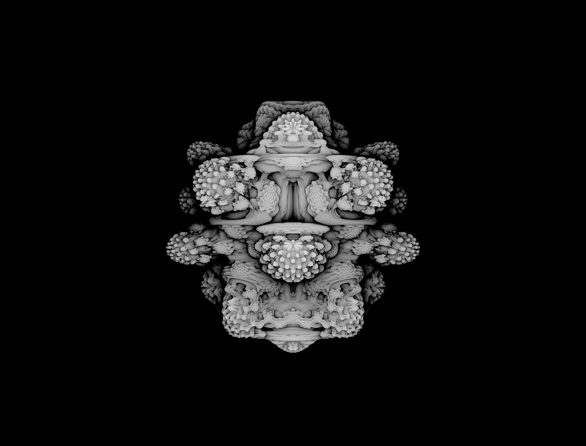

# Mandelbulb Ray Marcher

Basic ray marcher capable of rendering a particular type of 3D
fractal, the Mandelbulb (of different powers) in grey scale (using distance 
estimation as a form of ambient lighting).

### Resources

Some useful/interesting links on ray marching/3D fractals:

- http://jamie-wong.com/2016/07/15/ray-marching-signed-distance-functions/
- https://www.scratchapixel.com/lessons/advanced-rendering/rendering-distance-fields
- http://blog.hvidtfeldts.net/index.php/2011/06/distance-estimated-3d-fractals-part-i/ 
- https://www.skytopia.com/project/fractal/mandelbulb.html
- https://www.cs.drexel.edu/~david/Classes/Papers/rtqjs.pdf
